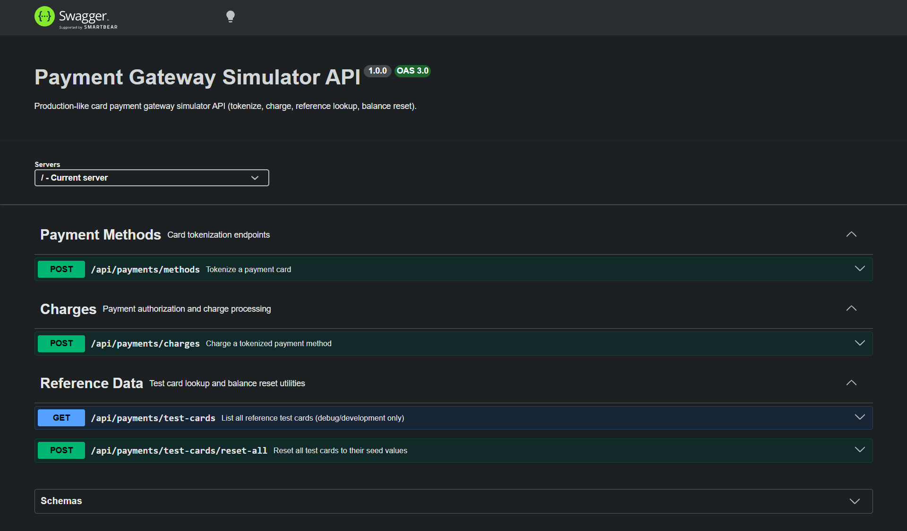

# 💳 Payment Gateway Simulator — Backend API

A production-grade Node.js/Express card payment gateway simulator designed for integration testing without a real bank connection or real money.

It implements a layered architecture (`routes → controllers → services → models`), Zod request validation, PCI-DSS compliant logging, rate limiting, localization, OpenAPI/Swagger documentation, and centralized error handling matching enterprise payment gateway standards.

> **HTTPS Deployment Note:** This service is designed to sit behind a TLS reverse proxy (e.g. Nginx, Cloudflare, AWS ALB) in non-local environments. In local development, it runs over HTTP.

---

## 1. Screenshots



---

## 2. Endpoints & Schema Examples

### `POST /api/payments/methods`

Tokenizes card details into a reusable `paymentMethodId` token after performing Luhn validation, status checks, and CVV verification.

#### Request Example (`TokenizeRequest`)
```json
{
  "cardNumber": "4539974024498311",
  "cardHolder": "DAVID MORENO",
  "expiryMonth": "11",
  "expiryYear": "2028",
  "cvv": "417"
}
```

#### Response Examples

##### `200 OK` — Success (`TokenizeResponse`)
```json
{
  "success": true,
  "paymentMethodId": "pm_7f3ab21c9e",
  "brand": "VISA",
  "last4": "8311",
  "expiryMonth": "11",
  "expiryYear": "2028"
}
```

##### `400 / 403 / 404 / 500` — Error (`ErrorResponse`)
```json
{
  "success": false,
  "errorCode": "CARD_EXPIRED",
  "message": "This card has expired"
}
```

---

### `POST /api/payments/charges`

Charges a tokenized payment method. Internal calculations are processed strictly in integer minor units (qəpik/cents).

#### Request Example (`ChargeRequest`)
```json
{
  "paymentMethodId": "pm_7f3ab21c9e",
  "amount": 45.50,
  "currency": "AZN"
}
```

#### Response Examples

##### `200 OK` — Success (`ChargeSuccessResponse`)
```json
{
  "success": true,
  "transactionId": "txn_c92f1a08e4",
  "status": "SUCCESS",
  "amount": 45.50,
  "currency": "AZN",
  "processedAt": "2026-07-27T14:06:29.000Z"
}
```

##### `400 / 402 / 403 / 404 / 429 / 500 / 504` — Error (`ChargeErrorResponse`)
```json
{
  "success": false,
  "errorCode": "INSUFFICIENT_FUNDS",
  "message": "Insufficient funds on the card",
  "transactionId": "txn_c92f1a08e5",
  "status": "FAILED",
  "processedAt": "2026-07-27T14:06:29.000Z"
}
```

---

### `GET /api/payments/test-cards`

Returns the list of 50 synthetic reference test cards with balances and statuses. Excludes CVV for PCI compliance.

#### Response Example (`TestCardsResponse`)
```json
{
  "cards": [
    {
      "cardNumber": "4539974024498311",
      "paymentMethodId": "pm_7f3ab21c9e",
      "cardHolder": "DAVID MORENO",
      "brand": "VISA",
      "last4": "8311",
      "expiryMonth": "11",
      "expiryYear": "2028",
      "balance": 842.30,
      "currency": "AZN",
      "status": "ACTIVE",
      "forcedResult": null
    }
  ]
}
```

---

### `POST /api/payments/test-cards/reset-all`

Restores every test card's balance, status, and forced result to original seed data values.

#### Response Example
```json
{
  "success": true,
  "resetCount": 50,
  "message": "All test card balances restored to seed values"
}
```

---

### `GET /health`

#### Response Example
```json
{
  "success": true,
  "message": "Payment Gateway Simulator is running"
}
```

---

## 3. Layered Architecture & Directory Structure

```
Backend-Payment-Test/
├── server.js                  ← Server entry point (loads env, handles process errors)
├── .env.example               ← Environment configuration template
├── docs/
│   └── swagger.yaml           ← Static OpenAPI 3.0 specification
├── screenshots/
│   └── payment-backend-swager-screenshot.png ← Swagger UI Screenshot
├── scripts/
│   └── verifyLuhn.js          ← Seed data Luhn validator script
├── src/
│   ├── app.js                 ← Express app initialization & middleware stack
│   ├── config/
│   │   ├── env.js             ← Zod environment validator
│   │   ├── swagger.js         ← Swagger-jsdoc generator
│   │   └── locales.js         ← Internationalization dictionary loader
│   ├── controllers/
│   │   └── paymentController.js ← HTTP adapter (request parsing, response formatting)
│   ├── errors/
│   │   └── customErrors.js    ← Typed operational errors (statusCode + errorCode)
│   ├── middlewares/
│   │   ├── errorMiddleware.js ← Centralized error handling & translation
│   │   ├── validateRequest.js ← Zod request body validation factory
│   │   ├── localizeMiddleware.js ← Accept-Language header parser
│   │   ├── rateLimitMiddleware.js ← express-rate-limit guard
│   │   └── requestLogger.js   ← PCI-DSS compliant request logger (PAN masked)
│   ├── models/
│   │   ├── cardStore.js       ← Data access object for cards.json (write-locked)
│   │   └── schemas/
│   │       ├── tokenizeSchema.js ← Tokenize request Zod schema
│   │       └── chargeSchema.js   ← Charge request Zod schema
│   ├── routes/
│   │   └── paymentRoutes.js   ← Express router with OpenAPI annotations
│   ├── services/
│   │   ├── paymentService.js  ← Core business logic (Luhn, status, balance check)
│   │   └── transactionService.js ← Transaction ID & timestamp generator
│   ├── locales/
│   │   ├── en.json            ← English error messages
│   │   ├── az.json            ← Azerbaijani error messages
│   │   └── ru.json            ← Russian error messages
│   ├── data/
│   │   ├── cards.seed.json    ← Immutable 50 synthetic test cards
│   │   └── cards.json         ← Working copy (created dynamically on boot)
│   └── utils/
│       ├── money.js           ← Minor/major unit precision currency converter
│       ├── catchAsync.js      ← Async error wrapper
│       ├── maskCardNumber.js  ← PCI-DSS card masking (•••• •••• •••• 8311)
│       ├── generateTransactionId.js ← Transaction ID generator (txn_...)
│       └── randomFailure.js   ← Simulated transient network failures (~5%)
```

---

## 4. Localization (`Accept-Language`)

Send the `Accept-Language` header to localize error messages:
- `Accept-Language: en` (English - Default)
- `Accept-Language: az` (Azerbaijani)
- `Accept-Language: ru` (Russian)

---

## 5. Error Codes & HTTP Status Mapping

| errorCode | HTTP Status | Meaning |
|---|---|---|
| `SUCCESS` | `200` | Charge completed successfully |
| `INSUFFICIENT_FUNDS` | `402` | Card balance is below charge amount |
| `CARD_EXPIRED` | `400` | Card expiry date has passed |
| `CARD_BLOCKED` | `403` | Card has been blocked |
| `CARD_DECLINED` | `403` | Generic bank decline (stolen/flagged) |
| `INVALID_CVV` | `400` | CVV code does not match card record |
| `INVALID_CARD_NUMBER` | `400` | Card number fails Luhn checksum or 16-digit format |
| `CARD_NOT_FOUND` | `404` | Card number not found in database |
| `PAYMENT_METHOD_NOT_FOUND` | `404` | `paymentMethodId` token not found |
| `NETWORK_TIMEOUT` | `504` | Simulated transient gateway failure (~5% roll) |
| `AMOUNT_INVALID` | `400` | Charge amount is zero or negative |
| `VALIDATION_ERROR` | `400` | Request body failed Zod schema validation |
| `RATE_LIMITED` | `429` | Exceeded rate limit for charges |

---

## 6. Setup & Installation

```bash
# 1. Install dependencies
npm install

# 2. Setup environment variables
cp .env.example .env

# 3. Run production server
npm start

# 4. Run development mode (with --watch auto-reload)
npm run dev
```

The server runs by default at `http://localhost:3001`.
Interactive Swagger UI is available at `http://localhost:3001/api-docs`.
